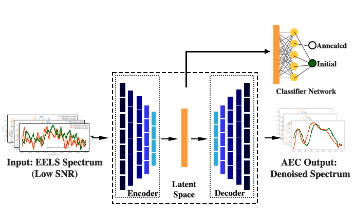

# rapidEELS

RapidEELS is a Autoencoder-Classifier Framework for denoising low SNR electron energy loss spectroscopy (EELS) spectra and classifying their oxidation state.

This code supplements the paper:    
**RapidEELS: Machine Learning for Denoising and Classification in Rapid Acquisition Electron Energy Loss Spectroscopy.**  
    *by Cassandra Pate (Johns Hopkins University, Department of Materials Science & Engineering);   
    James Hart (Yale University, Department of Mechanical Engineering & Materials Science);   
    Mitra Taheri (Johns Hopkins University, Department of Materials Science & Engineering)*  

## About 
This work was done as part of a study using SrFeO3-δ(δrepresents the oxygendeficiency) thin films, as a starting point for rapid identification of real-time EELS data. The films undergo an oxidation state changes from nominally SrFeO3(Fe4+) to SrFeO2.5(Fe3+) as target metrics to benchmark our algorithms.

The framework consists of two parts. First, the Autoencoder (AEC) is trained on high framerate, low signal to noise ratio (SNR) EELS spectra and their corresponding denoised, background subtracted data. This section comprises the denoising AEC. 
Second, a basic fully connected classifier is trained on the latent space representation from the AEC. This binary classifier decides if the oxidation state is "initial" or "annealed". 
And example of results is shown below.  

Future work will seek to expand classification from binary to multi-class and move away from a supervized to unsupervized approach. 

## Descriptions
- [EELS_model_training_GH.ipynb](https://github.com/patecm/rapidEELS/blob/main/EELS_model_training_GH.ipynb)
    - Notebook to train your own AEC and Classifier on binary state EELS data. 
    - DM4 files should end with 'a' if annealad (e.g. EELS thick 1_1a.dm4) for binary oxidation state data to be created correctly
- EELS thick 1_1a.dm4  
    - Example test DM4 file of a thick annealed sample  
- EELS thin 1_1.dm4  
    - Example test DM4 file of a thin initial state sample  
- aecModel-ld5.zip   
    - Trained Autoencoder model  
- classifierModel_binary.zip  
    - Trainied classifer model
 

### Usage

## Requirements
- Requires the open source Python library [HyperSpy](https://hyperspy.org/) to process DM4 data. 
- lmfit 1.0.2 (if training data has not been previously PowerLaw background subtracted)
- Tensorflow version 2.4.1
- Python 3.7.10
